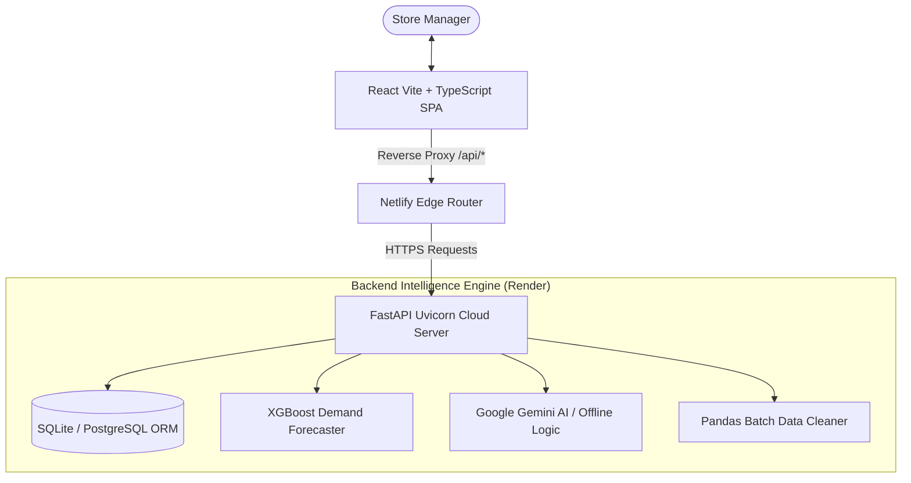

# StockSense AI 🛒
### AI-Powered Inventory Management System for Small Businesses & Kirana Stores

[](https://app.netlify.com)
[](https://stocksense-ai-backend.onrender.com)
[](https://github.com/Nihal0543/Stocksense---AI-Powered-Inventory-Management-system-For-Small-Businesses)
[](LICENSE)

---

## 🌐 Live Hosted Links

| Component | Platform | Live URL |
| :--- | :--- | :--- |
| **Frontend Web Application** | **Netlify** | [Open StockSense AI on Netlify](https://stocksense-ai-retail.netlify.app) *(or your configured Netlify site domain)* |
| **Backend REST API Server** | **Render** | [https://stocksense-ai-backend.onrender.com](https://stocksense-ai-backend.onrender.com) |
| **Interactive API Documentation** | **Render Swagger UI** | [https://stocksense-ai-backend.onrender.com/docs](https://stocksense-ai-backend.onrender.com/docs) |
| **Source Code Repository** | **GitHub** | [Nihal0543/Stocksense AI](https://github.com/Nihal0543/Stocksense---AI-Powered-Inventory-Management-system-For-Small-Businesses) |

---

## 📌 Project Overview

**StockSense AI** is a state-of-the-art retail decision intelligence and inventory management platform tailored specifically for small business owners and Indian Kirana stores. 

Traditional retail inventory management often suffers from manual stock counts, delayed reorders, tied-up working capital in slow-moving items, and unexpected stockouts of high-demand goods. StockSense AI bridges this gap by combining machine learning demand forecasting (XGBoost), scenario simulations, natural language database intelligence, and multilingual accessibility into an intuitive, glassmorphism-styled dashboard.

---

## ⚡ Key Highlights & Features

- 🇮🇳 **Bilingual Support (English & हिन्दी)**: Complete, instant localization toggle across all dashboards, forecast tables, decision tools, and AI prompts with native Devanagari typography.
- 💰 **Indian Rupee (₹ INR) Standard**: All sales KPIs, inventory valuation, holding costs, restocking orders, and simulations are formatted natively in **₹** with Indian numbering conventions (`en-IN`).
- 🌓 **Synchronized Dark & Light Theme**: Built-in instantaneous theme toggle with persistent storage, zero flash of unstyled content (FOUC), and tailored glassmorphic styling for low-light retail counters.
- 📊 **Executive Manager KPI Dashboard**: Real-time visibility into inventory turnover, today's sales revenue, stockout risks, category breakdowns, and low-stock alerts.
- 📦 **Smart Inventory Portal**: Search by SKU or product name, filter by category and warehouse, sort dynamically, and inspect stock health pills.
- 🔮 **Machine Learning Demand Forecasting**: Custom XGBoost regression engine that analyzes historical transactions, extracts seasonal lags, and predicts 7-day inventory demand with confidence bands.
- 🎯 **Decision Simulator**: Interactive playground where managers tweak pricing, discounts, and order sizes to simulate projected net margins, stockout probabilities, and ROI before committing cash.
- 🤖 **AI Kirana Store Assistant**: Retrieval-Augmented Generation (RAG) assistant powered by Google Gemini (with offline rule-engine fallback) that answers inventory questions in English and Hindi.
- 📥 **Batch CSV Data Ingestion**: Cleanse, normalize, and ingest supplier invoices and transaction logs with automated error-handling.

---

## 🔑 Quick Demo Credentials

Try the live application without setting up a new account:

- **Email**: `manager@retailstore.com`
- **Password**: `password123`
- *(Or click the **Auto-Fill** button on the Login screen)*

---

## 🏗️ Technical Architecture



### Technology Stack

| Layer | Technologies |
| :--- | :--- |
| **Frontend Framework** | React 19, TypeScript, Vite |
| **Styling & Design** | Tailwind CSS v4, Lucide Icons, Glassmorphism, Google Fonts (Inter, Outfit, Noto Sans Devanagari) |
| **Data Visualization** | Recharts (Area, Bar, and Donut Charts) |
| **Backend Framework** | Python 3.11, FastAPI, Uvicorn, SQLAlchemy |
| **Machine Learning** | XGBoost, Scikit-Learn, Pandas, NumPy |
| **Generative AI** | Google Gemini API (`google-genai` SDK) |
| **Deployment & Hosting** | Netlify (Frontend & SPA Edge Proxy), Render (Python FastAPI Web Service), GitHub Actions |

---

## 🚀 Local Installation & Development

### 1. Backend Setup

```bash
cd backend

# Create and activate virtual environment
python -m venv venv
# On Windows:
venv\Scripts\activate
# On Linux/macOS:
source venv/bin/activate

# Install dependencies
pip install -r requirements.txt

# Start FastAPI development server
uvicorn app.main:app --host 127.0.0.1 --port 8000 --reload
```

The backend will automatically create and seed the SQLite database with products, inventory, transactions, and a trained ML model upon first boot.

### 2. Frontend Setup

```bash
cd frontend

# Install node dependencies
npm install

# Start Vite dev server
npm run dev
```

Visit `http://localhost:5173` in your browser.

---

## 🐳 Docker Deployment

To spin up the entire application stack (PostgreSQL + FastAPI + Nginx React Frontend):

```bash
docker-compose up --build
```

Access the application at `http://localhost`.

---

## 📄 License

This project is licensed under the MIT License - see the [LICENSE](LICENSE) file for details.
